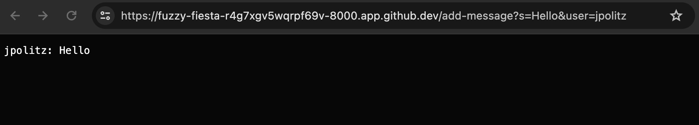
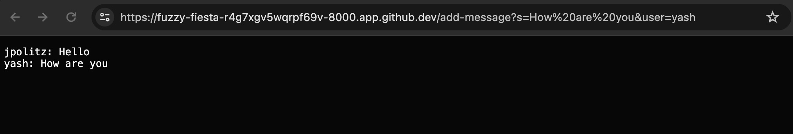
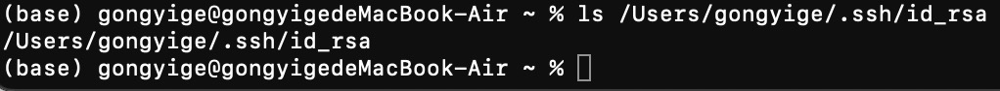
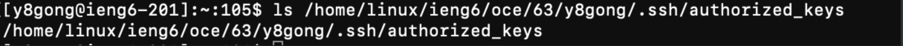
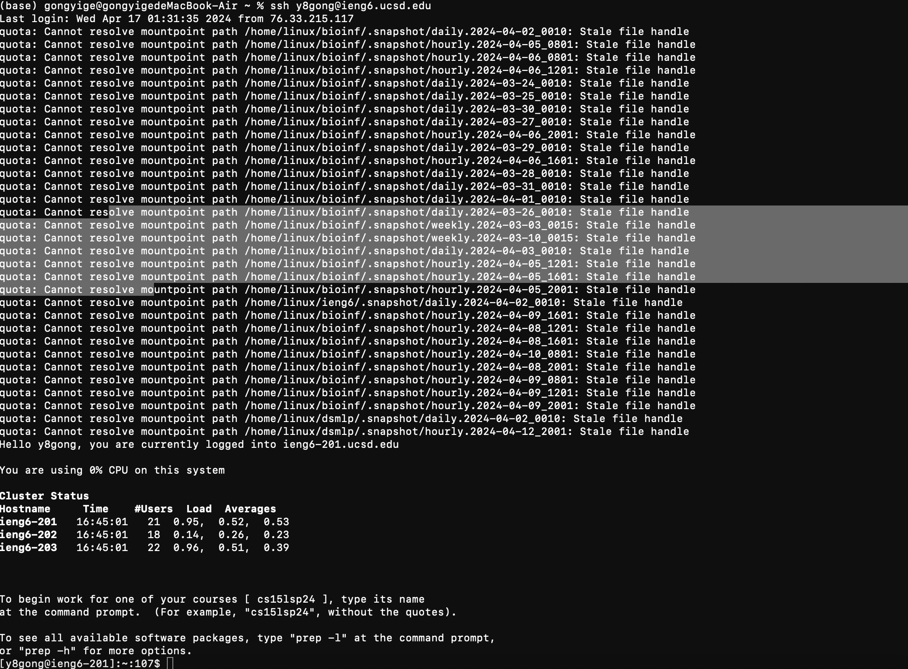

# cse-15L-lab-report2
# Part 1
## Code Part
### Server.java

```
// A simple web server using Java's built-in HttpServer
// Examples from https://dzone.com/articles/simple-http-server-in-java were useful references

import java.io.IOException;
import java.io.OutputStream;
import java.net.InetSocketAddress;
import java.net.URI;

import com.sun.net.httpserver.HttpExchange;
import com.sun.net.httpserver.HttpHandler;
import com.sun.net.httpserver.HttpServer;

interface URLHandler {
    String handleRequest(URI url);
}

class ServerHttpHandler implements HttpHandler {
    URLHandler handler;
    ServerHttpHandler(URLHandler handler) {
      this.handler = handler;
    }
    public void handle(final HttpExchange exchange) throws IOException {
        // form return body after being handled by program
        try {
            String ret = handler.handleRequest(exchange.getRequestURI());
            // form the return string and write it on the browser
            exchange.sendResponseHeaders(200, ret.getBytes().length);
            OutputStream os = exchange.getResponseBody();
            os.write(ret.getBytes());
            os.close();
        } catch(Exception e) {
            String response = e.toString();
            exchange.sendResponseHeaders(500, response.getBytes().length);
            OutputStream os = exchange.getResponseBody();
            os.write(response.getBytes());
            os.close();
        }
    }
}

public class Server {
    public static void start(int port, URLHandler handler) throws IOException {
        HttpServer server = HttpServer.create(new InetSocketAddress(port), 0);

        //create request entrypoint
        server.createContext("/", new ServerHttpHandler(handler));

        //start the server
        server.start();
        System.out.println("Server Started! If on your local computer, visit http://localhost:" + port + " to visit.");
    }
}
```

### ChatServer.java
```
import java.io.IOException;
import java.net.URI;

class Handler implements URLHandler {
  String toReturn="";
    public String handleRequest(URI url) {     
        if (url.getPath().contains("/add-message")) {
          //create empty variables to store the strings
          String stringToAdd = "";
          String userName = "";
          
          //split the string and the user name
          String[] parameters = url.getQuery().split("&");
          
          //split the two strings for the message and the username 
          String[] str = parameters[0].split("=");
          String[] user = parameters[1].split("=");
          
          // retrieve the string and username from str and user
          if (str[0].equals("s")){
            stringToAdd=str[1];
          }
          if(user[0].equals("user")){
            userName = user[1];
          }
          toReturn = toReturn+userName + ": "+stringToAdd+"\n";
        }
        else{
          System.out.println("404 not found!");
        }
      return toReturn;
      }
}

class ChatServer {
    public static void main(String[] args) throws IOException {
        if(args.length == 0){
            System.out.println("Missing port number! Try any number between 1024 to 49151");
            return;
        }

        int port = Integer.parseInt(args[0]);

        Server.start(port, new Handler());
    }
}
```
### Screenshot of Running the Code

1. The handleRequest method is called.
2. The argument passed in is ```/add-message?s=Hello&user=jpolitz```.
   Here is the list of all fields (before colon) and their corresponding values (after colon) for this argument:
   * parameters: ```["s=Hello", "user=jpolitz"]```
   * str: ```["s", "Hello"]```
   * user: ```["user","jpolitz"]```
   * stringToAdd: ```"Hello"```
   * userName: ```"jpolitz"```
   * toReturn: ```"jpolitz: Hello\n"```
3. Here is the list of the values for all fields before and after this request:
   * parameters: empty string, ```["s=Hello", "user=jpolitz"]```
   * str: empty string, ```["s", "Hello"]```
   * user: empty string, ```["user","jpolitz"]```
   * stringToAdd: empty string, ```"Hello"```
   * userName: empty string, ```"jpolitz"```
   * toReturn: empty string, ```"jpolitz: Hello\n"```


1. The handleRequest method is called.
2. The argument passed in is ```/add-message?s=How are you&user=yash```.
   Here is the list of all fields (before colon) and their corresponding values (after colon) for this argument:
   * parameters: ```["s=How are you", "user=yash"]```
   * str: ```["s", "How are you"]```
   * user: ```["user","yash"]```
   * stringToAdd: ```"How are you"```
   * userName: ```"yash"```
   * toReturn: ```jpolitz: Hello\nyash: How are you```
3. Here is the list of the values for all fields before and after this request:
   * parameters: ```["s=Hello", "user=jpolitz"]```, ```["s=How are you", "user=yash"]```
   * str: ```["s", "Hello"]```, ```["s", "How are you"]```
   * user: ```["user","jpolitz"]```, ```["user","yash"]```
   * stringToAdd: ```"Hello"```, ```"How are you"```
   * userName: ```"jpolitz"```, ```"yash"```
   * toReturn: ```"jpolitz: Hello\n"```, ```jpolitz: Hello\nyash: How are you```

# Part 2
1. 
2. 
3. 
# Part 3
1. In lab 2, I learned how to connect to remote server, and how to manipulate URL by changing the query.
2. In lab 3, I learned how to generate private and public key through which I can connect the remote server without entering my password. Also, I learned how to send files from local server to the remote server, and how to connect to the remote server on VS Code.
